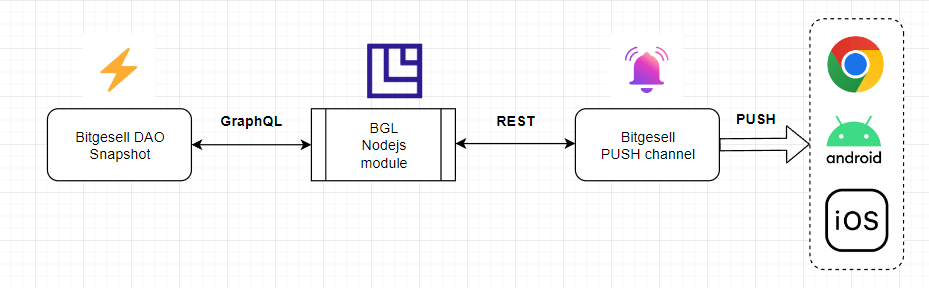

# Notification module for Bitgesell PUSH channel

[Bitgesell channel](https://app.push.org/#/channels) enabling notifications and messaging community members via browser's extension or mobile app.

*Currently, subscribers can receive instant notifications on new proposals, votes and followers carried out in Bitgesell DAO.*

Using [PUSH protocol](https://push.org), any smart contract, dApp, or backend service can send on-chain or off-chain notifications tied to the wallet addresses of users in a gasless, multichain, open, and platform-agnostic way.

